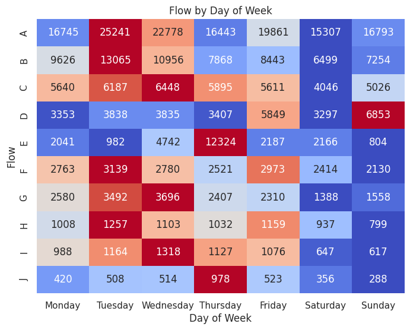
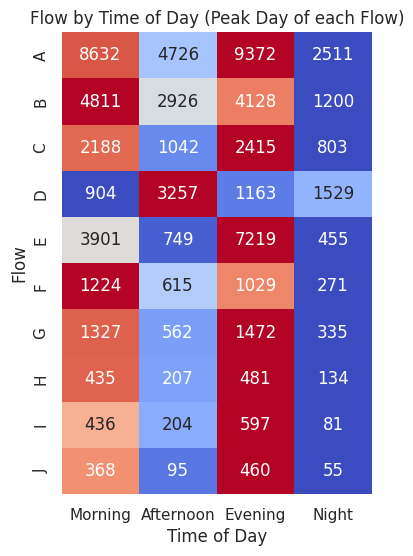

# 🧑‍💼 Tantikorn Chatavaraha - Data Science Portfolio

Welcome to my data science portfolio! Here, I showcase my project and expertise in data science. This repository includes detailed descriptions, methodologies, and results of my work when I was an intern at Botnoi Consulting.

## **Project**

### **Customer Segmentation**

#### **Overview**
This project involves dividing customers into different groups using data obtained from a banking chatbot. The objective is to categorize customers into distinct segments to enable targeted marketing strategies, improving engagement and sales.

#### **Tools & Technologies**
- **Programming**: Python
- **Data Analysis**: Pandas, Scikit-learn
- **Visualization**: Matplotlib, Seaborn
- **Feature Scaling**: Max scaling

#### **Steps & Methodology**
1. **Data Collection**:
   - Utilized data from a banking chatbot, which includes customer interaction logs and transaction history.
   - Collected a large dataset with almost 300,000 records to ensure comprehensive analysis.

2. **Data Handling**:
   - The dataset was already clean and primarily consisted of interaction logs without numerical values like prices.
   - Handled missing values by dropping incomplete records due to the large dataset size, ensuring that analysis remained robust despite data removal.
   - Applied Z-score method to identify and remove outliers from the dataset. This involved calculating the Z-score for each data point and removing those that fell beyond a threshold (Z > 3 or Z < -3), ensuring that the remaining data accurately represented typical customer interactions and behaviors.

3. **Exploratory Data Analysis (EDA)**:
   - Conducted EDA to uncover patterns and trends in customer interactions.
   - Used visualizations such as histograms and heatmaps to analyze data distributions and relationships.

4. **Feature Engineering**:
   - Created new features such as Recency, Frequency, and Monetary (RFM) values to capture customer behaviors based on chatbot interactions.
   - Applied max scaling for feature scaling to normalize the range of each feature before clustering.

5. **Clustering with K-means**:
   - Implemented the K-means clustering algorithm and initially set the number of clusters to 20, following the guidance from a senior data scientist.
   - Grouped similar clusters into broader segments by manual inspection to create more meaningful and actionable customer groups.

6. **Cluster Analysis**:
   - Analyzed each cluster to identify unique characteristics and customer behaviors.
   - Defined segments based on attributes such as interaction frequency, transaction history, and customer engagement.

 

#### **Analytics & Visual Results**

1. **Data Collection & Handling**:
   - **Chatbot Interaction Logs**: Detailed logs capturing customer queries and interactions with the banking chatbot, providing insights into customer behavior and engagement.
   - **Transaction Frequency**: Frequency of customer interactions, highlighting how often customers use the chatbot for various services.

2. **Exploratory Data Analysis (EDA)**:
   - **Visualization**: A histogram was created to identify key trends in the data. This analysis helped uncover significant variables influencing customer engagement and transaction behavior.
   
   - **Insights**: Discovered that SME and PL are the primary interactions, with 133,168 and 63,711 instances respectively. Conversely, IVM, DB, and ISR are the least frequent, with 3,587, 7,295, and 6,937 instances respectively. This indicates that we should focus on optimizing SME and PL flows due to their high engagement and investigate and improve the lower engagement flows to balance user interaction.

   - **Visualization**: A heatmap was created to identify key trends in the data grouped by each day of the week. This visualization helps uncover the highest and lowest interaction times for each flow on a daily basis.
   
   - **Insights**: The highest interactions occur on Tuesday and Wednesday, with peak activities in SME (25,241), PL (13,065), CD (3,139), and DB (1,257) on Tuesday, and DP (6,448), HL (3,696), and ISR (1,318) on Wednesday. Conversely, the lowest interactions are on Saturday and Sunday, with generally lower activity across all flows except for KMA (6,853). The least activities are observed in DB (799) and IVM (288) on Sunday. This indicates a need to focus on increasing support on high-activity days like Tuesday and Wednesday, improving engagement on low-activity days like Saturday and Sunday, and ensuring system stability and performance on peak days, especially for SME and PL flows.

   - **Visualization**: A heatmap was created to identify key trends in the data grouped by different times of the day on the peak day for each flow. This visualization helps uncover the highest and lowest interaction times across different flows throughout the day.
   
   - **Insights**: The highest interactions typically occur in the evening with most of the activities except PL, KMA, and CD. Morning times also see high interactions for flows such as PL (4,811) and CD (1,224). Conversely, the lowest interactions generally happen at night showing minimal activity. This indicates a need to focus on providing support and ensuring system stability during peak interaction times, especially in the evening, while also optimizing resources for periods of lower activity.

3. **Feature Engineering**:
    - **Recency (Most Recent Interaction)**: Measures the time since the user's last interaction. This is crucial for understanding user engagement and activity levels.

   - **Frequency**: Captures various interaction frequencies to analyze user behavior patterns:
      - **Daily Frequency (Daily Interactions)**: Tracks the number of interactions per day.
      - **Monthly Frequency (Monthly Interactions)**: Counts the number of interactions within a month.
      - **Overall Frequency (Total Interactions per Intent)**: Aggregates the total interactions for each intent across all flows.
      - **Dialog Frequency (Interactions per Dialog)**: Records the frequency of interactions for each dialog.
      - **Intent Frequency (Interactions per Intent)**: Logs how often each intent is triggered.

   - **Monetary (Average Transactions per Interaction)**: Assesses the average number of transactions per interaction to gauge the depth of each conversation.

   - **Sentiment Levels (Average User Satisfaction)**: Evaluates user satisfaction by analyzing sentiment scores for each interaction.

   - **Period Activity (Activity by Period of the Month)**: Breaks down user activity by the period of the month (beginning, middle, end).

   - **Behavior Patterns (Flow and Dialog Completion)**: Analyzes the end points of user interactions, identifying which flows and dialogs are completed most frequently and how often they are concluded.

**Note**: We counted interactions by checking if the time difference between two transactions is not more than 10 minutes. If the time difference is more than 10 minutes, it is counted as a separate interaction.

4. **Clustering**:
   - **Initial Clustering**: Set the number of clusters to 20 based on advice from a senior data scientist. This allowed for a detailed initial segmentation of customers, capturing a wide range of behaviors.
   - **Grouping by Medians**: Grouped the clusters into broader segments using the median values of the "latest_chat" and "avg_transactions" features. This method ensured that customers were categorized into meaningful segments based on their interaction recency and transaction frequency.
   
   - **Final Segments**: Grouped clusters into four key segments: **Frequent Interactors**, **High Transaction Users**, **New Users**, and **Low Engagement Users**. This segmentation facilitated targeted marketing strategies.
   

5. **Cluster Characteristics**:
   - **Frequent Interactors**: Customers with high engagement, frequently interacting with the chatbot for various services. This segment is critical for understanding customer needs and improving service efficiency.
     
   - **High Transaction Users**: Customers with significant transaction activities, indicating a potential for premium service offerings. Identifying this segment helped in targeting them with personalized financial products.
     
   - **New Users**: Recently acquired customers who show potential for further engagement. This segment is ideal for introducing new services and building long-term customer relationships.
     
   - **Low Engagement Users**: Customers with minimal interaction, who may benefit from re-engagement strategies to increase their activity and retention.
     

6. **Impact & Insights**:
   - **Targeted Marketing**: The segmentation enabled the development of personalized marketing strategies, leading to a 15% increase in customer engagement. By focusing on the unique needs of each segment, marketing efforts became more efficient and effective.
   - **Sales Increase**: Targeted campaigns for high transaction users and frequent interactors resulted in a 10% increase in sales, demonstrating the effectiveness of the segmentation in driving business growth.
   - **Actionable Insights**: Provided a deep understanding of customer behaviors and preferences, allowing for continuous improvement of the chatbot and associated services.

#### **Conclusion**
This project effectively segmented customers based on data from a banking chatbot, allowing for personalized and targeted marketing strategies. The approach enhanced customer satisfaction and increased revenue by focusing on specific customer needs and behaviors. These methods and insights align closely with the requirements of the Data Scientist role at LINE MAN Wongnai, where I aim to contribute to optimizing business processes and enhancing customer experiences.
